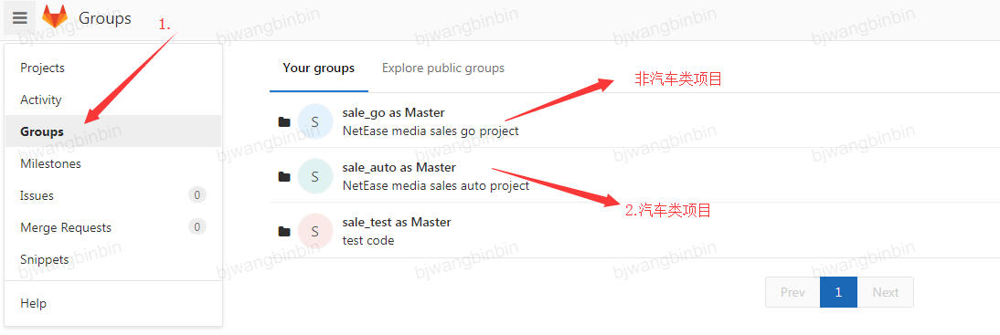
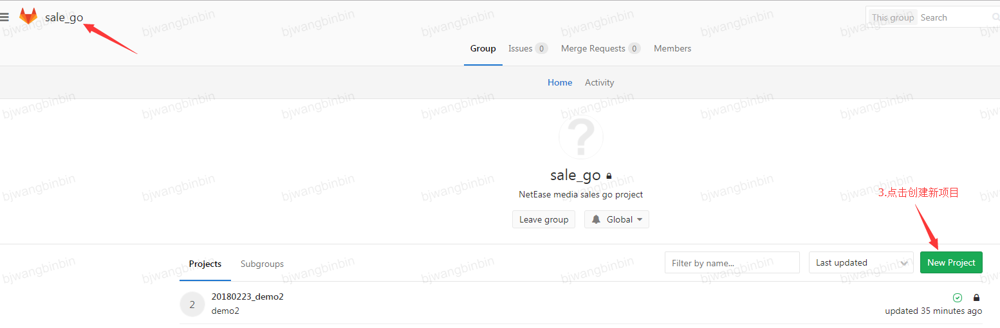
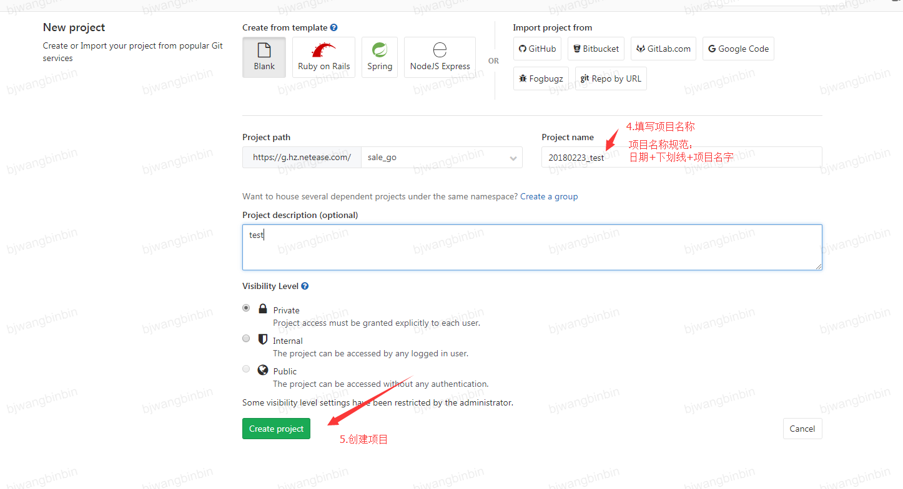
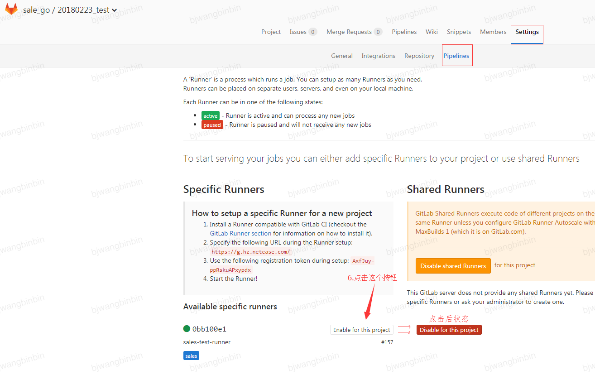
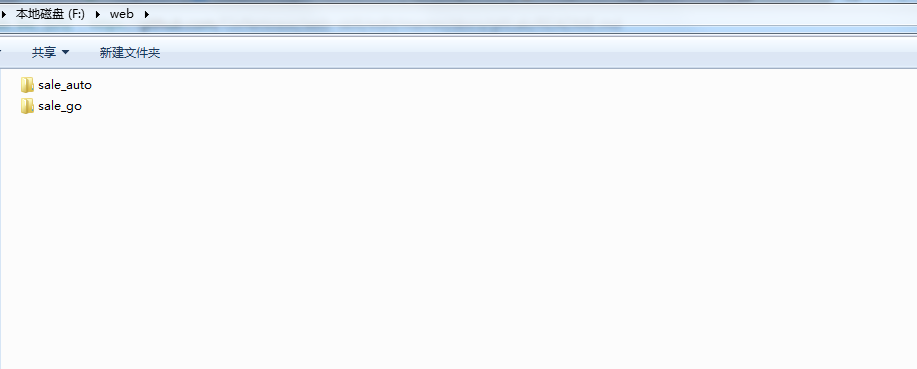
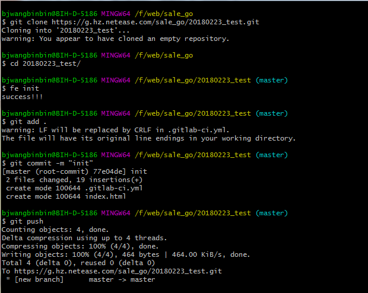

# gitLab 项目创建指南

1. 登录gitLab账号 https://g.hz.netease.com/ ，选择项目目录。如图：



2. 入sale_go,点击New Project 按钮创建新项目。如图：



3.填写项目名字,点击Create project 按钮生成项目。如图：
> 项目名称规范：创建日期+下划线+项目名字



4. 项目设置,依次点开Setting->Pipelines,点击 Enable for this project按钮。 如图：
> 注意：提交代码之前要进行此设置，提交代码之后再设置这个，可能测试链接打不开



5.设置好之后，如图：


6. 在本地创建项目目录，找任意盘符下面创建web/sale_auto 和 web/sale_go
> 项目的前级目录必须为sale_auto或者sale_go




7. 本地创建项目和提交，如图：
> 先安装这个插件 https://www.npmjs.com/package/netease-f2e  ps：安装过就不必安装了。在mac上 .gitlab-ci.yml文件默认是隐藏的，Command+Shift+. 可以显示隐藏文件、文件夹，再按一次，恢复隐藏

> `git config --global credential.helper store`   用户名和密码永久缓存

  
  * `git clone https://g.hz.netease.com/sale_go/20180223_test.git`
  * `cd 20180223_test`
  * `fe init`
  * `git add.`
  * `git commit -m "init"`
  * `git push`
  
  


8. 项目地址为：
  * sale_go
  ```
  测试地址：http://test.go.163.com/web/sale_go/20170817_taiji/index.html
  正式地址：http://go.163.com/web/20170817_taiji/
  ```
  * sale_auto
  ```
  测试地址：http://test.go.163.com/web/sale_auto/20170503_chery/index.html
  正式地址：http://s.auto.163.com/web/20170503_chery/
  ```
  
