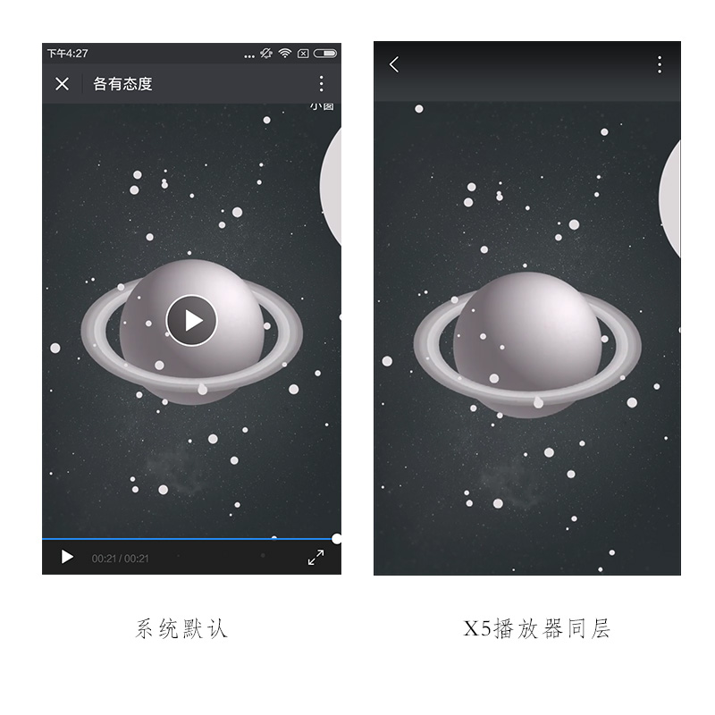

# 移动端常见问题 #
移动端开发常见问题汇总

## 目录
- [视频自适应全屏实现方法](#视频自适应全屏实现方法)
- [PC全屏视频实现方法](#PC全屏视频实现方法)
- [需要长按但不选中文本的方法](#需要长按但不选中文本的方法)
- [微信客户端二维码长按识别注意事项](#微信客户端二维码长按识别注意事项)
- [安卓输入框弹出键盘遮盖住文本框的解决办法](#安卓输入框弹出键盘遮盖住文本框的解决办法)
- [移动端全屏视频播放解决办法](#移动端全屏视频播放解决办法)
- [视频自动播放（使用canvas实现，安卓端可以内嵌自动播放）](https://github.com/randomlwh/jsmpeg-ffmpeg)

### 视频自适应全屏实现方法

```html
<div class="video-box">
	<video class="video poster="" src="" preload="auto" x-webkit-airplay="true" playsinline="true" webkit-playsinline="true"></video>
</div>
```

```css
.video-box {
	width: 100%;
	height: 100%;
	position: absolute;
	top: 0;
	left: 0;
}

.video{
	width:100%;
	height:100%;
	object-fit: cover;
}

```

### PC全屏视频实现方法


```html
//HTML
<div class="video-box">
	<video class="action" poster="" src="" preload="auto" width="640" height="1030" x-webkit-airplay="true" playsinline="true" webkit-playsinline="true"></video>
</div>
```

```css
//css
.video-box {
	width: 100%;
	height: 100%;
	position: absolute;
	top: 0;
	left: 0;
	background: none no-repeat center; 
}
.video-box video {
    position: absolute
}
```

```javascript
//js
function eResize(e){
	var cw = 640,
	ch = document.documentElement.clientHeight,
		vScale, vwScale, vhScale;
	vwScale = cw / 640, vhScale = ch / 1030;
	vScale = vwScale > vhScale ? vwScale : vhScale;
	$(e).css({
		'-webkit-transform': 'scale(' + vScale + ')',
		'-webkit-transform-origin': 'center top'
	});
} 
eResize('.video-box');
$(window).bind("resize",function(){
	eResize('.video-box');
});
```


### 需要长按但不选中文本的方法

```css
//css
-webkit-touch-callout: none; /* disables the callout */
-webkit-user-select:none;
```

### 微信客户端二维码长按识别注意事项

```html
//html 用img标签

```

//css 不要用绝对定位 定位时只能用padding
```css
.qr {
    padding: 327px 0 0 144px;
}
```

### 安卓输入框弹出键盘遮盖住文本框的解决办法

```javascript
if(/Android [4-6]/.test(navigator.appVersion)) {
	window.addEventListener("resize", function() {
		if(document.activeElement.tagName=="INPUT" || document.activeElement.tagName=="TEXTAREA") {
			window.setTimeout(function() {
				document.activeElement.scrollIntoViewIfNeeded();
			},0);
		}
	})
}
```

### 移动端全屏视频播放解决办法

安卓微信默认与使用X5同层对比图


Demo： [点此查看](http://test.go.163.com/go/2015/public/team/ningbo/geyoutaidu/test.html)  
原文链接： [点此查看](https://zhuanlan.zhihu.com/p/27559167)

```html
<meta name="viewport" content="width=640,target-densitydpi=device-dpi,user-scalable=no">
<body>
<div class="video-box">
	<!--安卓下视频蒙版 点击播放视频-->
	<div class="masker">
	    <div class="btn-play"></div>
	</div>
	<!--X5播放器下伪标题栏-->
	<header id="header" class="header"></header>
	<video id="video" 
	  class="video" 
	  poster="img/bg.jpg" 
	  src="http://flv2.bn.netease.com/videolib3/1707/31/UwslJ1623/HD/UwslJ1623-mobile.mp4" 
	  preload="auto" 
	  x-webkit-airplay="true" 
	  playsinline="true" 
	  webkit-playsinline="true" 
	  x5-video-player-type="h5" 
	  x5-video-player-fullscreen="true">
	</video>
</div>
</body>
```

```css
.video-box {
	width: 100%;
	height: 100%;
	position: absolute;
	top: 0;
	left: 0;
	background: none no-repeat center; 
}
.video {
	position: absolute;
	width: 100%;
}
.fullscreen .video {
	width: 100%;
	height: 100%;
	/*X5播放器视频的位置，此处下移128像素*/
	object-position: center 128px;
}
/*X5播放器下伪标题栏*/
.fullscreen .header {
	width: 100%;
	height: 128px;
	background: #373B3E;
	position: absolute;
	top: 0;
	left: 0;
	z-index: 9999;
}
.masker{
	position: absolute;
	width: 100%;
	height: 100%;
	left: 0;
	top: 0;
	background: url("../img/poster.jpg") no-repeat center;
	z-index: 100;
	display: none;
}
.btn-play{
	position: absolute;
	width: 100px;
	height: 100px;
	left: 0;
	right: 0;
	bottom: 0;
	top: 0;
	margin: auto;
	background: url("http://go.163.com/2017/0914/xx2/img/btn-play.png") no-repeat;
	-webkit-background-size: 100% 100%;
	background-size: 100% 100%;
}
```

```javascript
// 安卓微信下X5播放器初始化
var player = document.getElementById('video');

player.addEventListener('x5videoenterfullscreen', function() {
	// 在body上添加样式类以控制全屏下的展示
	document.body.classList.add('fullscreen');
});

player.addEventListener('x5videoexitfullscreen', function() {
	document.body.classList.remove('fullscreen');
}, false);

// 安卓下视频蒙版控制
if(netease.ua.android && (netease.ua.weixin || netease.ua.newsapp)){
	$('.masker').show();
	$('.masker').click(function(){
		$('#video')[0].play();
		setTimeout(function(){
			$('.masker').hide();
		},500);
	});
}

eResize('.video-box');
$(window).bind("resize",function(){
	eResize('.video-box');
});
function eResize(e){
	var cw = 640,
	ch = document.documentElement.clientHeight,
	vScale, vwScale, vhScale;
	vwScale = cw / 640, vhScale = ch / 1030;
	vScale = vwScale > vhScale ? vwScale : vhScale;
	$(e).css({
		'-webkit-transform': 'scale(' + vScale + ')',
		'-webkit-transform-origin': 'center top'
	});
} 
```
